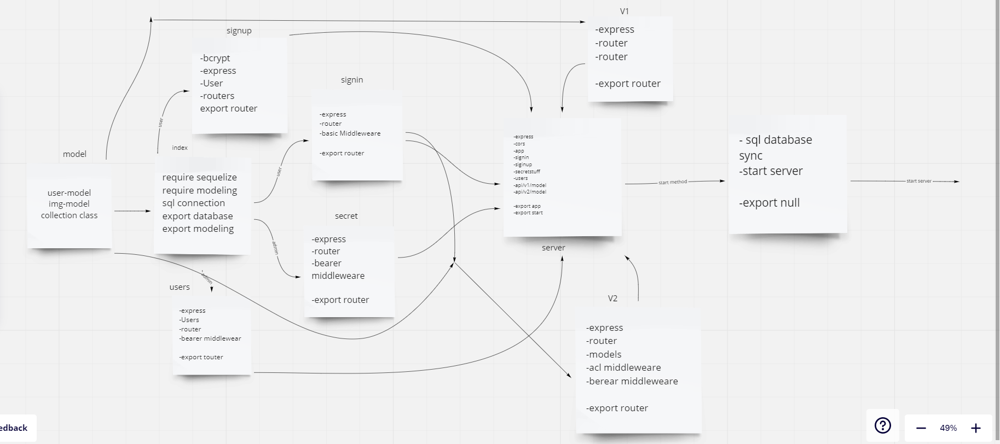

# auth-api

## Desicrption
- Create files for the project.
- create the important packages like sequrlize and express etc.
- create server , root index , router and middlewear and models.
- create /signin and /signup route /secritstuff /users(for testing)  /api/v1/model  api/v2/model.
- Two middleware : BasicAuth ,BeareAuth ,
- and test the routes .

## Path and body

post/signup

post/signin

get/secretstuff

get/users for use router you need to sign in before and git token and go to bearer Auth the same /sectretstuff

body{

    username take string 

    password take string 

    role take string {admin , editor , writer , user }

}

get,get(id),post,put(id),delete/api/v1/img

body{

    imgUrl take string 

    imgName take string

}

get,get(id),post,put(id),delete/api/v2/img

here we need token in beare Auth from signup or signin before 

body{

    imgUrl take string 

    imgName take string

}

## UML

# links

- [pull requist](https://github.com/WalidAlrefai/auth-api/pull/1)
- [heroku](https://walid-auth-api.herokuapp.com/)
- [action](https://github.com/WalidAlrefai/auth-api/actions)
